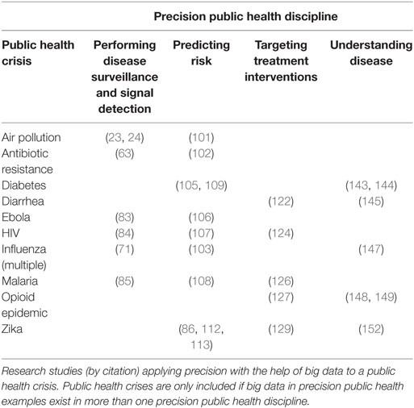
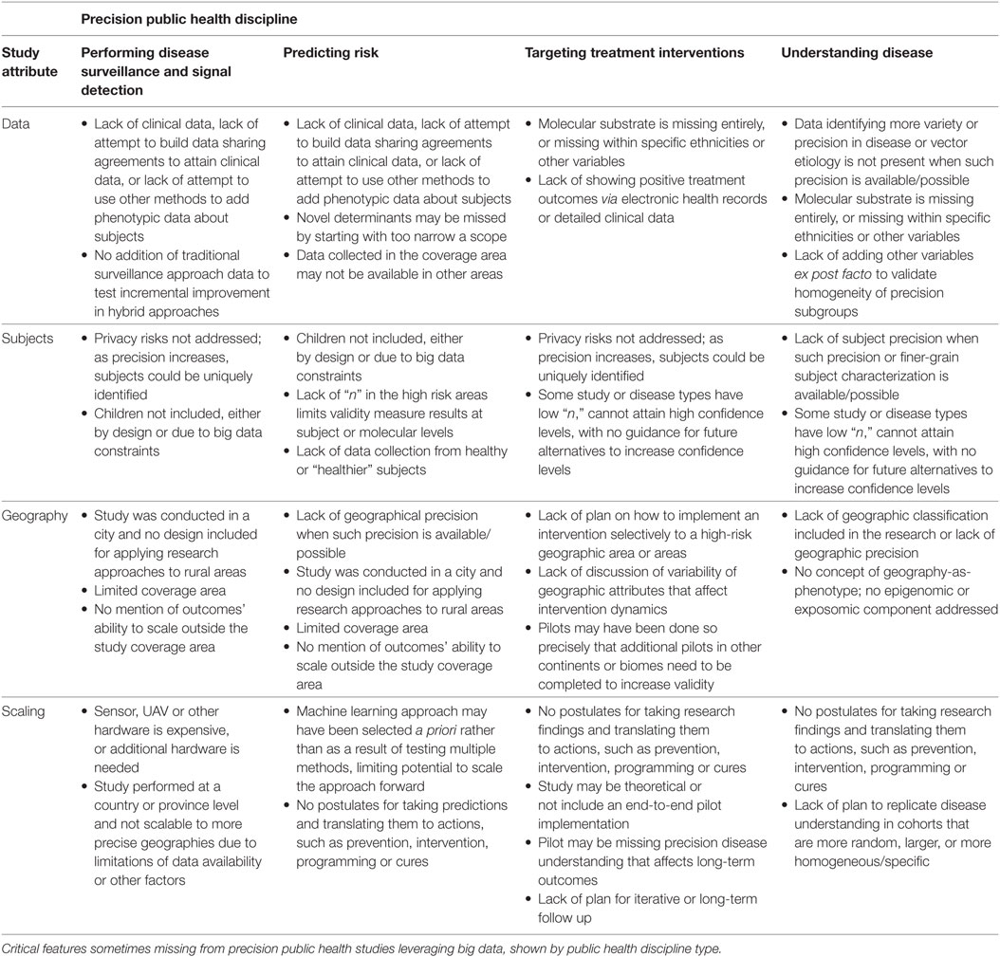

Precision public health
================
Julian Flowers
02/10/2018

## What is precision public health?

  - A recently coined term first appearing in print in 2014(Dolley 2018)
  - Sparse literature
  - Various definitions but all encompass a set of consistent ideas:
      - Use of *big data* and new tehcnology to improve health
      - Data used to give more precise descriptions of populations and
        individuals
      - Application of new techniques and methods
      - Speed, accuracy and scale
      - “improving the ability to prevent disease, promote health, and
        reduce health disparities in populations by applying emerging
        methods and technologies for measuring disease, pathogens,
        exposures, behaviors, and susceptibility in populations; and
        developing policies and targeted implementation programs to
        improve health” (Khoury and Galea 2016)
      - “requires robust primary surveillance data, rapid application of
        sophisticated analytics to track the geographical distribution
        of disease, and the capacity to act on such
        information”\[Dowell2016\]
      - “Precision public health is characterized by discovering,
        validating, and optimizing care strategies for
        well-characterized population strata”(Arnett and Claas 2016)

## Current and possible uses

Current literature has identified 4 main use cases for precision public
health:

1.  Disease surveillance and signal detection
2.  Risk prediction
3.  Targeting treatment interventions
4.  Improved disease understanding

These are largely in environmental health and communicable disease
control. The only studies identified by Dolley in non-communicable
disease or broader public health relate to diabetes.

## Precision ph vs precision medicine

There has been some debate about the relationship or otherwise between
precision medicince and precision public health. There are number of
strands:

1.  The 4 Ps of precision medicine (….) should be extended to 5 with the
    addition of P for “population”…
2.  Some argue that the two are unconnected
3.  Some argue that the precision medicine is the antihesis of precision
    medicine and that precision medicine may not improve health and may
    increase inequality, and will divert resources and focus away from
    population health and prevention

## Critiques and controversies

## Implications for health intelligence

In some ways these ideas are nothing new - our users and stakeholders
continually want more granularity and timeliness, more comprehensive
data and insight, and actionable data linked to intervention. We have
anlytical techniques like population segmentation, risk profiling and
geodemographics.

Arnett, Donna K., and Steven A. Claas. 2016. “Precision medicine,
genomics, and public health.” *Diabetes Care*.
<https://doi.org/10.2337/dc16-1763>.

Dolley, Shawn. 2018. “Big Data’s Role in Precision Public Health.”
*Frontiers in Public Health*.
<https://doi.org/10.3389/fpubh.2018.00068>.

Khoury, Muin J., and Sandro Galea. 2016. “Will Precision Medicine
Improve Population Health?” *JAMA*.
<https://doi.org/10.1001/jama.2016.12260>.

